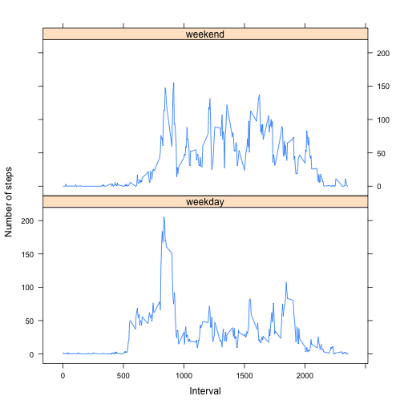

## Loading and preprocessing the data

```r
if (!file.exists("./data/activity.csv")) {
    url = "https://d396qusza40orc.cloudfront.net/repdata%2Fdata%2Factivity.zip"
    download.file(url, destfile="./data/archived_data.zip", method="curl")
    unzip("./data/archived_data.zip", exdir = "./data")
}

d <- read.csv("./data/activity.csv", sep=",", header=TRUE, 
                 colClasses=c("integer", "character", "integer"))
d$date <- as.Date(d$date, format="%Y-%m-%d")
```


## What is mean total number of steps taken per day?

```r
d.complete <- na.omit(d)
dailySteps <- tapply(d.complete$steps, d.complete$date, sum)
hist(dailySteps, xlab="Steps", main="Histogram of Daily Steps")
```

 

```r
mean(dailySteps)
```

```
## [1] 10766
```

```r
median(dailySteps)
```

```
## [1] 10765
```


## What is the average daily activity pattern?

```r
intervalMeanSteps <- tapply(d.complete$steps, d.complete$interval, mean)
plot(rownames(intervalMeanSteps), intervalMeanSteps, type="l", 
     xlab="Interval", ylab="Steps", main="Average Steps per 5-Minute Interval")
```

 

```r
maxIndex <- which.max(intervalMeanSteps)
maxInterval <- rownames(intervalMeanSteps)[maxIndex]
```

The interval with the highest mean number of steps per day is 835 
where the individual averaged 206.1698 steps.

## Imputing missing values

```r
numMissingVals <- nrow(subset(d, is.na(steps)))
```

There are 2304 missing values.  

**Strategy for Replacing Missing Values**

*I will replace the missing
values with the median values for the 5-minute time period to which they 
belong.*


```r
intervalMedianSteps <- tapply(d$steps, d$interval, median, na.rm=TRUE)
impData <- d

# replaces NAs with the median value for the interval
swapMedianNA <- function(i) {
    if (is.na(impData$steps[i])) {
        interval <- as.character(impData$interval[i])
        impData$steps[i] <<- intervalMedianSteps[interval]
    }
}

lapply(1:nrow(impData), swapMedianNA)

impDailySteps <- tapply(impData$steps, 
                                  impData$date, 
                                  sum, 
                                  na.rm=TRUE)
```

The histograms for the imputed data appear increases the number of days in the
0-5000 step bucket by about 8. Everything else appears similar.


```r
par(mfrow=c(1,2))
hist(dailySteps, xlab="Steps", main="Daily Steps")
hist(impDailySteps, xlab="Steps", main="Imputed Daily Steps")
```

 

The mean imputed steps per day are 1262 less than the mean non-imputed steps.


```r
mean(impDailySteps)
```

```
## [1] 9504
```

```r
mean(impDailySteps) - mean(dailySteps)
```

```
## [1] -1262
```

The median for imputed and non-imputed steps is the same.


```r
median(impDailySteps)
```

```
## [1] 10395
```

```r
median(impDailySteps) - median(impDailySteps)
```

```
## [1] 0
```

## Are there differences in activity patterns between weekdays and weekends?

On weekdays it appears the individual was less active during typical business
hours when compared with the activity on the weekend.  It also appears the
individual was more active after presumably waking up in the morning on 
weekdays when compared with weekends.


```r
# Create "day" vector to delineate weekdays from weekend days
day <- as.character(weekdays(impData$date))

# Determines whether the day is a weekday or weekend
weekendOrWeekday <- function(i) {
    if (day[i] %in% c("Saturday", "Sunday")) {
        day[i] <<- "weekend"
    } else {
        day[i] <<- "weekday"
    }
}

# Change day of week to "weekday" or "weekend"
lapply(1:length(day), weekendOrWeekday)
day <- as.factor(day)
impData <- cbind(impData, day)

# Compute the mean steps for both weekday and weekend for each interval
aggData <- aggregate(impData$steps, 
                     list(day = impData$day, interval = impData$interval), 
                     mean)
# Rename calculated column containing mean steps/interval
names(aggData)[3] = "steps"

# Load the lattice library
library(lattice)

xyplot(steps ~ interval | day, data = aggData, layout = c(1,2), type='l',
       xlab="Interval", ylab="Number of steps")
```

 
